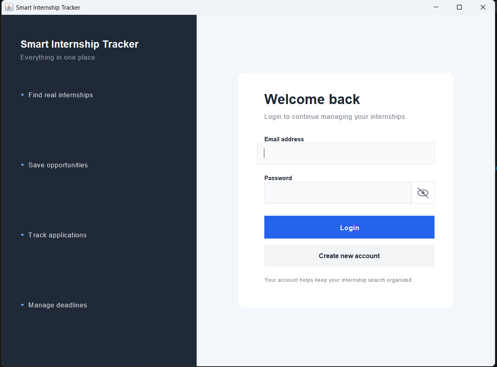
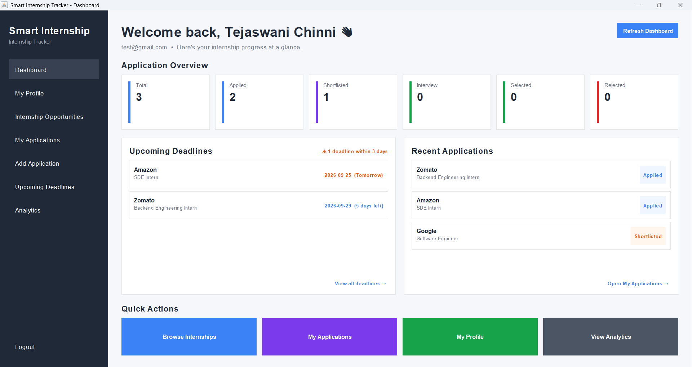
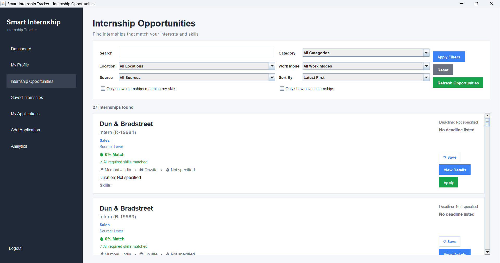
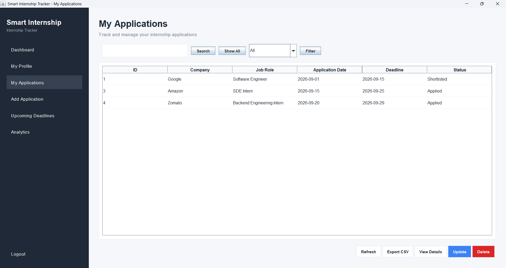
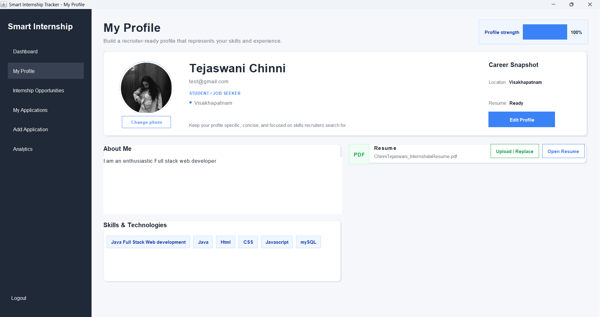

# Smart Internship Tracker

Smart Internship Tracker is a Java desktop application that helps students discover real internship opportunities, save opportunities they are interested in, apply through official employer application pages, and track their internship applications in one place.

The application uses public internship listings from supported Greenhouse and Lever job boards rather than generated or fake internship data.

## Demo

### Download

[Download Smart Internship Tracker v1.0.0](https://github.com/Tejaswani97/SmartInternshipTracker/releases/latest)

The release contains the runnable desktop application, required libraries, database schema, configuration template, and setup instructions.

### Screenshots

#### Login



#### Dashboard



#### Internship Discovery



#### Application Tracking



#### Profile



---

## Features

- User registration and login
- Email OTP verification during registration
- Student profile management
- Profile photo support
- Resume management
- Real internship listings from supported Greenhouse and Lever job boards
- Internship search
- Internship filtering
- Filtering by category, location, work mode, and source
- Skill-based internship matching
- Save and unsave internships
- Saved Internships section
- Internship details view
- Public recruiter contact information when available
- Official employer application links
- Duplicate application prevention
- Application status tracking
- Application search and filtering
- Upcoming application deadlines
- Dashboard statistics
- Deadline reminders
- CSV export for applications
- Automatic refreshing of supported internship sources

---

## How It Works

### 1. Register

A student creates an account using their name, email address, and password.

An OTP is sent to the registered email address for verification.

### 2. Login

After successful registration and email verification, the student can log in to the application.

### 3. Build a Profile

Students can manage their profile information, including:

- Name
- Location
- Skills
- Bio
- Resume
- Profile photo

### 4. Discover Internships

The application retrieves internship opportunities from supported public Greenhouse and Lever job boards.

The retrieved opportunities are stored in MySQL and displayed inside the application.

### 5. Search and Filter

Students can search and filter internships using information such as:

- Role
- Category
- Location
- Work mode
- Source
- Required skills
- Latest postings
- Deadline
- Skill match

### 6. Save Internships

Students can save internships they are interested in and access them later from the Saved Internships section.

### 7. Apply

Smart Internship Tracker does not automatically submit job applications.

Instead, the application opens the official employer application page in the user's browser.

After the student submits the application on the employer's website, the application asks the student to confirm the submission before adding it to My Applications.

### 8. Track Applications

Students can track their applications and update their status.

Supported statuses include:

- Applied
- Shortlisted
- Interview
- Selected
- Rejected

The dashboard also provides application statistics and upcoming deadline information.

---

## Data Sources

The application integrates with publicly available job-board APIs.

### Greenhouse

Internship opportunities are retrieved from supported public Greenhouse job boards through the Greenhouse job board API.

### Lever

Internship opportunities are retrieved from supported public Lever postings through the Lever postings API.

Only opportunities returned by the supported sources are imported into the application.

The application does not generate fake internship listings.

---

## Tech Stack

### Programming Language

- Java

### GUI

- Java Swing

### Database

- MySQL
- JDBC

### APIs

- Greenhouse Job Board API
- Lever Postings API

### Libraries

- MySQL Connector/J
- Gson

### Email

- Brevo

### Tools

- Git
- GitHub
- VS Code / IntelliJ IDEA

---

## Architecture

Smart Internship Tracker follows a layered Java application structure.

```text
                         ┌─────────────────────┐
                         │       Student       │
                         └──────────┬──────────┘
                                    │
                                    ▼
                         ┌─────────────────────┐
                         │     GUI Layer       │
                         │     Java Swing      │
                         └──────────┬──────────┘
                                    │
                         ┌──────────▼──────────┐
                         │      DAO Layer      │
                         │ Database Operations │
                         └──────────┬──────────┘
                                    │
                         ┌──────────▼──────────┐
                         │    MySQL Database   │
                         └─────────────────────┘


     Greenhouse API ─────┐
                         │
                         ▼
                    ┌─────────────┐
                    │  API Layer  │
                    │ Greenhouse  │
                    │   + Lever   │
                    └──────┬──────┘
                           │
                           ▼
                       DAO Layer
                           │
                           ▼
                     MySQL Database
```

### GUI Layer

Located in:

```text
src/gui/
```

Contains the Java Swing screens and dialogs used by students.

Examples include:

- Login
- Registration
- Dashboard
- Internship Opportunities
- Applications
- Profile
- Analytics
- Internship Details

### API Layer

Located in:

```text
src/api/
```

Handles retrieval of internship information from supported public sources.

### DAO Layer

Located in:

```text
src/dao/
```

Handles database operations for:

- Users
- Applications
- Internships
- Saved internships
- Email verification

### Model Layer

Located in:

```text
src/model/
```

Contains the application's core models such as:

- User
- Internship
- Application

### Utility Layer

Located in:

```text
src/util/
```

Contains supporting functionality such as:

- Database connection
- Email service
- Skill matching
- Skill match results

---

## Project Structure

```text
SmartInternshipTracker/
│
├── src/
│   ├── api/
│   │   ├── GreenhouseSource.java
│   │   └── LeverSource.java
│   │
│   ├── dao/
│   │   ├── ApplicationDAO.java
│   │   ├── EmailVerificationDAO.java
│   │   ├── InternshipDAO.java
│   │   ├── SavedInternshipDAO.java
│   │   └── UserDAO.java
│   │
│   ├── gui/
│   │   ├── AddApplicationFrame.java
│   │   ├── AnalyticsFrame.java
│   │   ├── ApplicationsFrame.java
│   │   ├── DashboardFrame.java
│   │   ├── InternshipDetailsDialog.java
│   │   ├── InternshipsFrame.java
│   │   ├── LoginFrame.java
│   │   ├── ProfileFrame.java
│   │   ├── RegisterFrame.java
│   │   └── UpdateApplicationFrame.java
│   │
│   ├── model/
│   │   ├── Application.java
│   │   ├── Internship.java
│   │   └── User.java
│   │
│   ├── util/
│   │   ├── DatabaseConnection.java
│   │   ├── EmailService.java
│   │   ├── SkillMatcher.java
│   │   └── SkillMatchResult.java
│   │
│   └── Main.java
│
├── lib/
│   ├── gson-2.14.0.jar
│   └── mysql-connector-j-26.7.0.jar
│
├── docs/
│   └── screenshots/
│       ├── login.png
│       ├── Dashboard.png
│       ├── internships.png
│       ├── applications.png
│       └── Profile.png
│
├── .gitignore
├── config.properties
└── README.md
```

> `config.properties` is a local configuration file and should not be committed to GitHub.

---

## Database

The application uses MySQL for persistent data storage.

Main tables include:

- `users`
- `applications`
- `internships`
- `email_verifications`
- `saved_internships`

The `internships` table also stores source information and external job identifiers to support internship synchronization and duplicate prevention.

---

## Setup

### Requirements

- Java JDK
- MySQL
- Git
- Internet connection for internship source refresh and email verification

### 1. Clone the repository

```bash
git clone https://github.com/Tejaswani97/SmartInternshipTracker.git
cd SmartInternshipTracker
```

### 2. Create the database

Run:

```sql
CREATE DATABASE IF NOT EXISTS internship_tracker;
```

Then run the database schema provided in:

```text
database.sql
```

### 3. Configure the application

Create a local:

```text
config.properties
```

using:

```text
config.properties.example
```

Example:

```properties
DB_URL=jdbc:mysql://localhost:3306/internship_tracker
DB_USERNAME=root
DB_PASSWORD=YOUR_MYSQL_PASSWORD

BREVO_API_KEY=YOUR_BREVO_API_KEY
BREVO_SENDER_EMAIL=YOUR_EMAIL
BREVO_SENDER_NAME=Smart Internship Tracker
```

Replace the placeholder values with your local configuration.

### 4. Run from source

Compile the application using the required libraries and run:

```text
Main
```

The application starts with the Smart Internship Tracker login screen.

---

## Running the v1.0.0 Demo

Download the latest release:

[Smart Internship Tracker v1.0.0](https://github.com/Tejaswani97/SmartInternshipTracker/releases/latest)

Extract the ZIP file.

The release contains:

```text
SmartInternshipTracker.jar
lib/
config.properties.example
database.sql
SETUP.md
run.bat
```

Copy:

```text
config.properties.example
```

to:

```text
config.properties
```

and configure your local MySQL and Brevo settings.

Then run:

```text
run.bat
```

or use:

```bash
java -cp "SmartInternshipTracker.jar;lib/*" Main
```

---

## Application Flow

```text
Register
   │
   ▼
Email OTP Verification
   │
   ▼
Login
   │
   ▼
Dashboard
   │
   ├───────────────┐
   ▼               ▼
Profile       Internship Discovery
                  │
                  ├── Search
                  ├── Filter
                  ├── Skill Match
                  └── Save
                       │
                       ▼
                Internship Details
                       │
                       ▼
             Official Employer Page
                       │
                       ▼
              Submit Application
                       │
                       ▼
              Confirm Submission
                       │
                       ▼
              My Applications
                       │
                       ▼
             Track Application
```

---

## Application Tracking

The tracker helps students maintain their own application records.

It supports:

- Application dates
- Deadlines
- Status updates
- Job links
- Notes
- Search
- Filtering
- Duplicate prevention
- CSV export

The application does not automatically read employer emails or ATS systems to determine whether a student received an interview or offer.

---

## Security and Configuration

Sensitive credentials are kept outside the committed source code.

The following local files should not be committed:

```text
config.properties
.env
*.class
```

The real MySQL password and Brevo API key should never be placed directly in Java source code or the public README.

Use:

```text
config.properties.example
```

as the configuration template.

---

## Release

Current stable release:

**v1.0.0**

[Download the latest release](https://github.com/Tejaswani97/SmartInternshipTracker/releases/latest)

---

## Future Improvements

Possible future improvements include:

- More public internship source integrations
- Advanced internship recommendations
- Improved resume-to-internship matching
- Application notifications
- Email-based application status detection
- Cloud database support
- Web-based version of the application
- Mobile application support

---

## Author

**Chinni Tejaswani**

- GitHub: https://github.com/Tejaswani97
- LinkedIn: https://www.linkedin.com/in/tejaswani-chinni-b02409340
- Email: tejaswani.chinni7@gmail.com